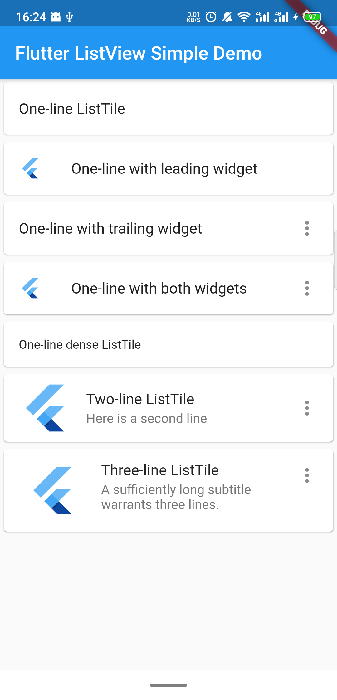
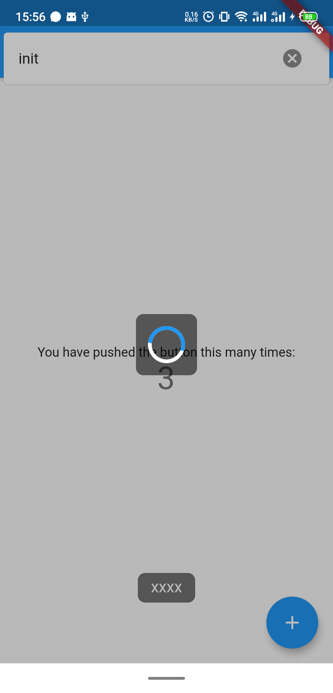
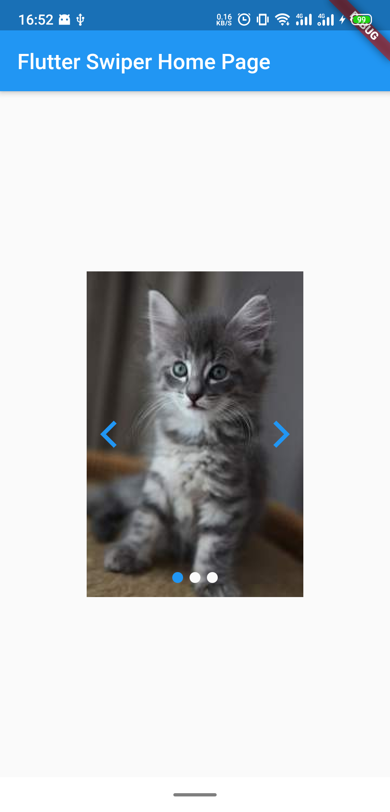
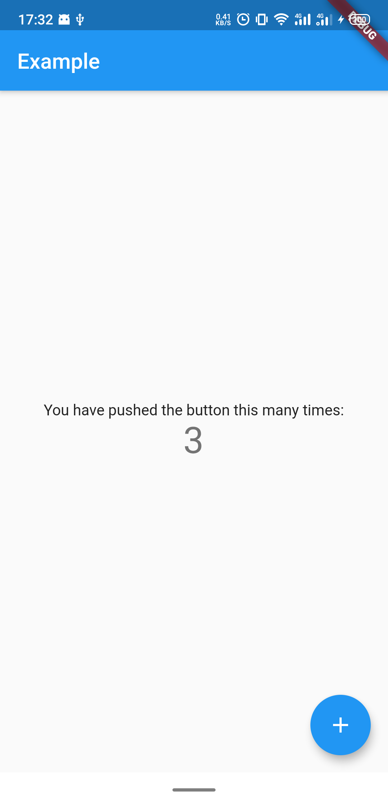
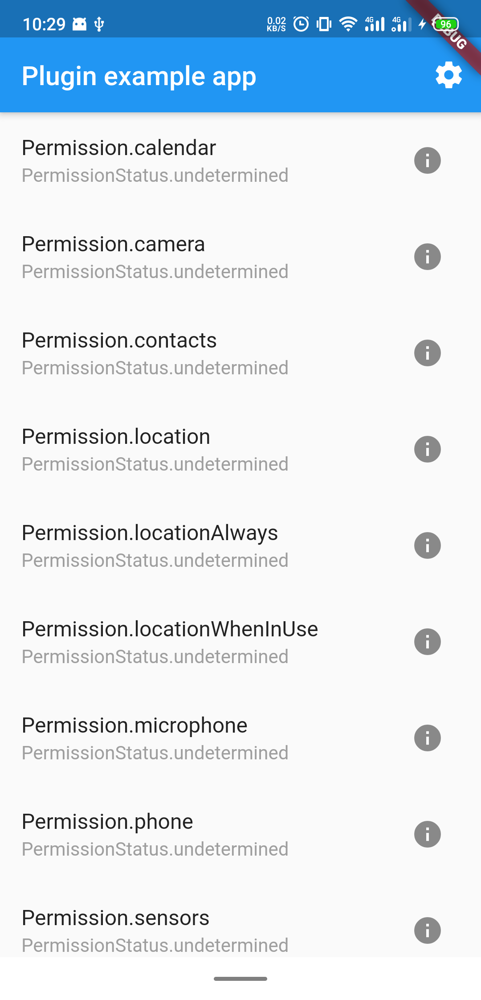
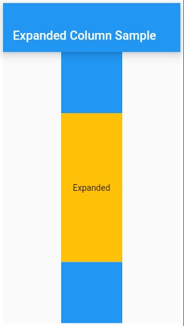
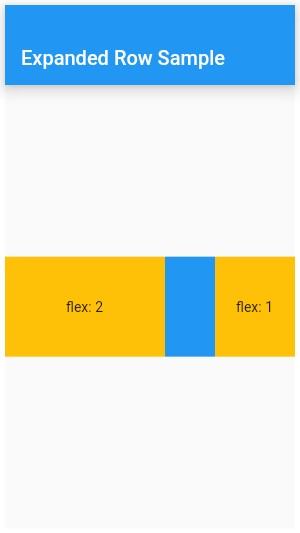

# flutter-examples

Some examples of Flutter

## Example apps

1.  [ListView simple](/listview_simple)

Reference: [ListTile Class](https://api.flutter.dev/flutter/material/ListTile-class.html)

2. [ListView Dismissible](/listview_dismissible)

Reference: [Implement swipe to dismiss](https://flutter.dev/docs/cookbook/gestures/dismissible)

3. [Work with long lists](/long_lists)

How to use **ListView.builder**

Reference: [Work with long lists](https://flutter.dev/docs/cookbook/lists/long-lists)

4. [shared preferences](/shared_preferences_example)

Reference: [Shared preferences plugin](https://pub.dev/packages/shared_preferences)

[Saving and reading data in Flutter with SharedPreferences](https://medium.com/@suragch/saving-and-reading-data-in-flutter-with-sharedpreferences-bb4238d3105)

5. [async await](/async_await_example)

Reference: [Asynchronous programming: futures, async, await](https://dart.dev/codelabs/async-await#sequential-processing-async)

Future.wait

[How to run multiple Dart futures in parallel](https://alvinalexander.com/dart/how-run-multiple-dart-futures-in-parallel)

[Dartlang wait more than one future](https://stackoverflow.com/questions/42176092/dartlang-wait-more-than-one-future)

Future.then chain call

[Flutter篇之你真的会使用Future吗？](https://juejin.im/post/5d317e5af265da1b6c5faf73)

Futurn.forEach

[Dart Fundamentals – Async / Await](https://codingwithjoe.com/dart-fundamentals-async-await/)

6. [Container](/container)

Reference: [Container class](https://api.flutter.dev/flutter/widgets/Container-class.html)

7. [startup_namer](/startup_namer)

Reference: [Write your first Flutter app, part 1](https://flutter.dev/docs/get-started/codelab)

[Write your first Flutter app, part 2](https://codelabs.developers.google.com/codelabs/first-flutter-app-pt2/#2)

8. [Debugging UI Cheat Sheet](/debugging_ui_cheat_sheet)

Reference: [Debugging UI Cheat Sheet](https://medium.com/@louagejulien/flutter-debugging-ui-cheat-sheet-18a7b09dd468)

9. [InkWell](/inkwell)

Reference: [InkWell class](https://api.flutter.dev/flutter/material/InkWell-class.html)

10. [url_launcher](/url_launcher_example)

Reference: [url_launcher](https://pub.dev/packages/url_launcher)

11. [encrypt_example](/encrypt_example)

Reference: [encrypt](https://pub.dev/packages/encrypt)

12. [qrcode_scan](/qrcode_scan)

Reference: [qrscan](https://pub.dev/packages/qrscan)

13. [RaisedButton](/raised_button_example)

Reference: [RaisedButton](https://api.flutter.dev/flutter/material/RaisedButton-class.html)

14. [FlatButton](/flat_button_example)

Reference: [FlatButton](https://api.flutter.dev/flutter/material/FlatButton-class.html)

15. [IconButton Example, IconButton adding a filled background, Ink Widget, Padding Widget](/icon_button_example)

Reference: [IconButton](https://api.flutter.dev/flutter/material/IconButton-class.html)

16. [Outline Button](/outline_button_example)

Reference: [OutlineButton](https://api.flutter.dev/flutter/material/OutlineButton-class.html)

17. [Row, FittedBox](/row_example)

Reference: [Row](https://api.flutter.dev/flutter/widgets/Row-class.html)

18. [ConstrainedBox, SizedBox, BoxConstrains.tightFor()](https://book.flutterchina.club/chapter5/constrainedbox_and_sizebox.html)

Reference: [尺寸限制类容器](https://book.flutterchina.club/chapter5/constrainedbox_and_sizebox.html)

19. [QRCode Scanner](/qrcode_scanner_example)

Reference: [Flutter: QR Code Scanner App | Barcode Scan](https://www.youtube.com/watch?v=siuJhQ9BqsU)

[Flutter QRCode Scanner APP](https://github.com/iampawan/FlutterQRScanner-App)

[Android dependency 'androidx.core:core' has different version for the compile (1.0.0) and runtime (1.0.1) classpath. You should manually set the same version via DependencyResolution](https://github.com/flutter/flutter/issues/27254)

[barcode_scan](https://pub.dev/packages/barcode_scan)

20. [simple dialog](/simple_dialog_demo)

Reference: [SimpleDialog Class](https://api.flutter.dev/flutter/material/SimpleDialog-class.html)

21. [alert dialog](/alert_dialog_demo)

textfield in an AlertDialog

Reference: [AlertDialog class](https://api.flutter.dev/flutter/material/AlertDialog-class.html)

22. [flutter_slidable](/flutter_slidable_example)

slidable list item

Reference: [flutter_slidable](https://pub.dev/packages/flutter_slidable)

23. [nested_tabs](/nested_tabs_example)

Reference: [https://github.com/Oclemy/nested_tabs](https://github.com/Oclemy/nested_tabs)

24. [BotToast](/bot_toast_example)

BotToast, including Notification and Loading

Reference: [https://pub.dev/packages/bot_toast](https://pub.dev/packages/bot_toast)

25. [flutter_swiper](/flutter_swiper_example)

Swiper example

Reference: [https://pub.dev/packages/flutter_swiper](https://pub.dev/packages/flutter_swiper)

26. [provider](/provider_example)

Provider example

Reference: [https://pub.dev/packages/provider#-example-tab-](https://pub.dev/packages/provider#-example-tab-)

27. [provider_shopper](/provider_shopper_example)

Provider shopper example

Reference: [https://github.com/flutter/samples/tree/master/provider_shopper](https://github.com/flutter/samples/tree/master/provider_shopper)

Reference: [Simple app state management](https://flutter.dev/docs/development/data-and-backend/state-mgmt/simple)

28. [permission_handler](/permission_handler_example)

Reference: [https://pub.dev/packages/permission_handler#-readme-tab-](https://pub.dev/packages/permission_handler#-readme-tab-)

29. [expanded](/expanded_example)

This example shows how to use an [Expanded] widget in a [Column] so that it's middle child, a [Container] here, expands to fill the space.

Reference: [Expanded class](https://api.flutter.dev/flutter/widgets/Expanded-class.html)

30. [expanded with flex factor](/expanded_example2)

This example shows how to use an [Expanded] widget in a [Row] with multiple children expanded, utilizing the [flex] factor to prioritize available space.

Reference: [Expanded class](https://api.flutter.dev/flutter/widgets/Expanded-class.html)

31. [file_picker_example](/file_picker_example)

A package that allows you to use a native file explorer to pick single or multiple absolute file paths, with extensions filtering support.

Reference: [file_picker][https://pub.dev/packages/file_picker]

